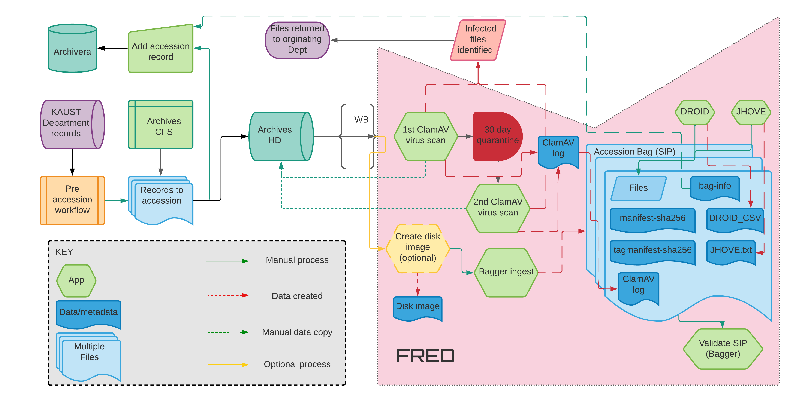

# ArchiveAutomation



Automate the digital preservation workflow. 

The workflow have the following steps:

1. Run the antivirus.
1. Create a _bag_ file from the source folders.
1. Create a XML file Dublin Core.
1. Run Droid for extraction of the metadata.
1. Run JHove as a complement of the metadata.

Next we describe the usage of the script, and the installation of dependencies are below

## Usage

The usage assumes that the repository is already cloned, and we are ready to run the script.

### Update Local Repository

Update the repository to latest version

```
mgarcia@arda:~/Documents/Work/ArchiveAutomation$ git pull
Already up to date.
mgarcia@arda:~/Documents/Work/ArchiveAutomation$ 
```

### Start Virtual Environment

Activate the virtual environment:

```
#
# Windows
#
PS C:\Users\garcm0b\OneDrive - KAUST\Documents\Work\ArchiveAutomation> .\venv\Scripts\activate
#
# Linux
#
mgarcia@mordor:~/Documents/Work/ArchiveAutomation$ . venv/bin/activate
```

### Workflow Input File

The takes a single argument: a file describing all information for the workflow. The name (and extension) of file are irrelevant. Any valid filename would be acceptable. 

The steps in the workflow are represented by sections of the input file, like ACCESSION, BAGGER, CLAMAV, etc. The order of the section does not matter. But the they can't be removed.

An example of input file

```
#
# Configuration file for the digital preservation workflow
# 

[ACCESSION]
accession_id = 013_002_0026

[BAGGER]
# You can specify a comma separated list of directories as source: dir1, dir2, ...
source_dir = C:\Users\joe\pictures\boat_trip_pictures, C:\Users\joe\Work\documents
# Using Python ExtendedInterpolation to use the 'accession_id' as target directory
dest_dir = C:\Users\garcm0b\Work\${ACCESSION:accession_id}

[DROID]
droid_dir = C:\Users\joe\Work\Droid\droid
droid_bin = droid.bat
# The profile is the database with the metadata in binary format. 
# We just want the csv file, so we remove the profile.
keep_profile = true

[JHOVE]
jhove_dir = C:\Users\joe\Work\jhove
jhove_bin = jhove.bat
jhove_module = jpeg-hul
jhove_xml = true
```

> The `BAGGER:dest_dir` can't exist, otherwise the script will stop. By default, the directory name will be accession number, but it can be customized by the user. Like:
> `dest_dir = /path/to/my/bag/dir`

#### Droid and Jhove

> There can't be any space in the `droid` path, otherwise the `droid.bat` script will fail. This means that installing `droid` in the `C:\Program Files` will not work.

Both sessions for [Droid](https://www.nationalarchives.gov.uk/information-management/manage-information/preserving-digital-records/droid/) and [Jhome](http://jhove.openpreservation.org/) are very similar. They have the path to the installation directory, the name of executable program, and some parameter. For `droid`, the parameter is whether the Droid profile should be kept after running the script or not. For `jhove` it's the option to save the output in XML format.

### Running the Script

Once the input file is ready, simply call the script with the input file as parameter.

```
(venv) PS C:\Users\garcm0b\Work\ArchiveAutomation> archiveautomation .\my_accession.cfg
Have a nice day.
(venv) mgarcia@wsl2:~/Documents/Work/ArchiveAutomation$
```

The script prints help message when no input file is provided

```
(venv) mgarcia@arda:~/Documents/Work/ArchiveAutomation$ archiveautomation 
Usage: archiveautomation [OPTIONS] INPUT
Try 'archiveautomation --help' for help.

Error: Missing argument 'INPUT'.
(venv) mgarcia@arda:~/Documents/Work/ArchiveAutomation$ 
```

Or the script can be called with the `--help` parameter

```
venv) mgarcia@arda:~/Documents/Work/ArchiveAutomation$ archiveautomation --help
Usage: archiveautomation [OPTIONS] INPUT

  Automate digital preservation workflow.

  From INPUT creates a BagIt directory, and DC core complaint file.
(...)
```

## Configuration

### Clone the repository

Clone the repository

```
PS C:\Users\garcm0b\Work> git clone https://github.com/kaust-library/ArchiveAutomation.git
```

### Virtual Environment and Dependencies

Create a virtual environment for the project

```
#
# Windows
#
PS C:\Users\garcm0b\OneDrive - KAUST\Documents\Work\ArchiveAutomation> python -m venv venv
#
# Linux
#
mgarcia@mordor:~/Documents/Work/ArchiveAutomation$ python3 -m venv venv
```

Setup the environment

```
pip install --editable .
```

This will install all dependencies listed in the section `install_requires` of the `setup.py` file.

### Configuration File

The configuration details for the script are in the file `etc/archiveautomation.cfg.` When cloning the environment, the configuration file will be just a reminder (with an `example` extension) that it needs to be edited with the correct values, and save it as `archiveautomation.cfg.`

Currently the only parameter in the configuration file is the setup of ArchivEra API

```
#
# Define the parameters for ArchivEra API
#

[API]
url = 'https://path.to.archive/public'
client_id = 'api_client'
grant_type = 'my grant type'
username = 'my API user'
database = 'my database'
```

### ArchivEra API Password

The API password is handled in 2 ways: declaring it as an environment variable, or via `.env` file. For first case, set password according to your operating system:

```
# Windows
(venv) PS C:\Users\garcm0b\OneDrive - KAUST\Documents\Work\ArchiveAutomation\src> $ENV:ARCHIVERA_API_PW='hello_mg'
# Linux
(venv) mgarcia@mordor:~/Documents/Work/ArchiveAutomation/src$ export ARCHIVERA_API_PW="hello"
```

The second way of using the [password is via a `.env`](https://yuthakarn.medium.com/how-to-not-show-credential-in-jupyter-notebook-c349f9278466) in the same directory as the main program. The file is a simple `key=value` pair:

```
(venv) PS C:\Users\garcm0b\Work\ArchiveAutomation> cat .env
ARCHIVERA_API_PW='hello_world'
(venv) PS C:\Users\garcm0b\Work\ArchiveAutomation>
```
